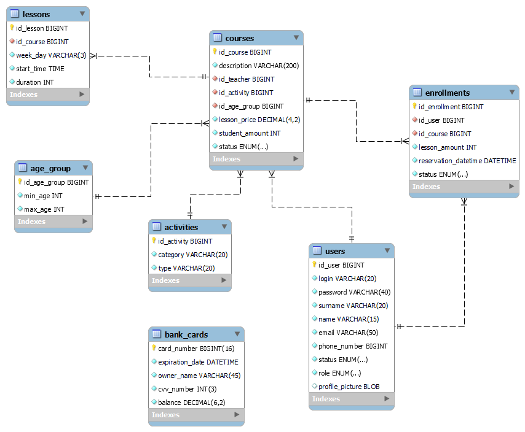

## Production Center "STUPENI"

The web project provide various courses on different musical directions (vocal, choreographic, instrumental etc.). 
User can look through activities, courses & choose the most preferable, and after enrolling on some has convenient access
to the timetable & all personal enrollments. Teacher in his turn has access to personal timetable. Admin have rights to 
manage users & teachers, courses & enrollments etc. 4 access roles are provided: Guest, User, Teacher & Admin. Also 
project is supplied with localization into 3 languages: English, Russian & Deutsch.

### Admin

- Manage account:
    - View account info
    - Change account photo
    - Change account info
- Manage courses:
    - View all courses
    - View particular course info
    - Search courses by:
        - activity category
        - activity type
        - week day
        - few or all of these options at a time
    - Add course
    - Update course info & status
- Manage enrollments:
    - View all enrollments
    - Approve users' enrollments
    - Search by status
- Manage users:
    - Assign teachers
    - Change users' status
    - Search teachers by:
        - surname
        - name
        - holding lessons
        - few or all of these options at a time
    - Search users by:
        - surname
        - name
        - status
        - few or all of these options at a time

### Teacher

- Manage account:
    - View account info
    - Change account photo
    - Change account info
- Manage courses:
    - View all courses
    - View particular course info
    - Search courses by:
        - activity category
        - activity type
        - week day
        - few or all of these options at a time
- View timetable for lessons
- View all activities

### User

- Manage account:
    - View account info
    - Change account photo
    - Change account info
    - Replenish balance
- Manage courses:
    - View all courses
    - View particular course info
    - Search courses by:
        - activity category
        - activity type
        - week day
        - few or all of these options at a time
    - Enroll on course
- Manage enrollments:
    - View personal enrollments
    - Pay for enrollment
    - Update enrollment
    - Delete enrollment
- View timetable for lessons
- View suggested activities
- View contacts

### Guest

- Sign in
- Sign up
- Look through courses:
    - View all courses
    - View particular course info
    - Search courses by:
        - activity category
        - activity type
        - week day
        - few or all of these options at a time
- View suggested activities
- View contacts

